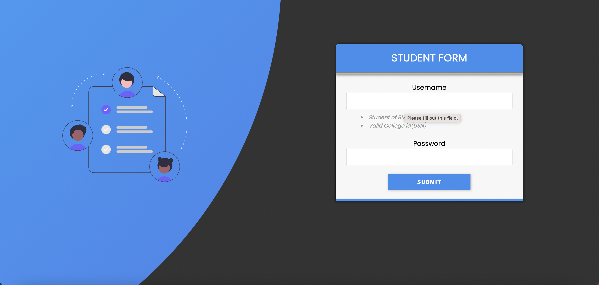
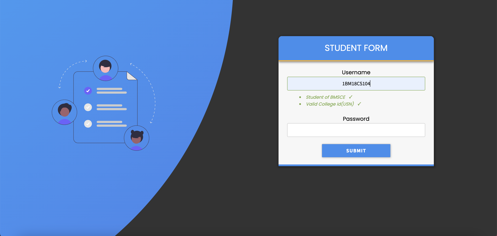

## Student & Teacher SignUp pages 

 &nbsp;&nbsp;This folder contains the signUp pages for the student(Student_login.php) as well as the teacher(Teacher_login.php).
These pages are bulit using PHP and SQL primarily with a touch of html [And CSS for the Styling].

### Student SignUp page 

 
 - Here, the Student is only allowed to enter there collegeID and there respective password

 
 > This feature was implement using Regular expressions 

- When the student enters there valid ID they will altered by adding a *tick* mark next to
  respective constraint

